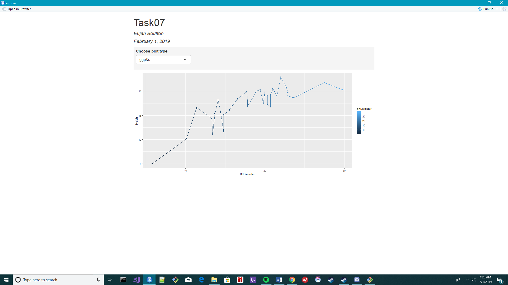

```{r setup, include=FALSE}
knitr::opts_chunk$set(echo = TRUE)
```

# Task 1

The working directory

```{r}
getwd()
```

# Task 2

First 6 lines of data

```{r}
trees = read.csv("SPRUCE.csv")
head(trees)
```

# Task 3

Scatter plot of data

```{r}
with(trees, 
  plot(Height~BHDiameter, bg = "Blue", pch = 21, cex = 1.2,
       main = "Base Diameter Vs. Height", ylim = c(0, 1.1*max(Height)), xlim = c(0, 1.1*max(BHDiameter)))
)
```

Three trendscatter plots of the data

```{r}
library(s20x)
with(trees, {
layout(matrix(1:3, nr = 1, nc = 3))
  trendscatter(Height~BHDiameter, f = 0.5, data = trees, main = "Height vs Diameter, f = .5")
  trendscatter(Height~BHDiameter, f = 0.7, data = trees, main = "Height vs Diameter, f = .7")
  trendscatter(Height~BHDiameter, f = 0.9, data = trees, main = "Height vs Diameter, f = .9")
})
```

Linear model over a plot of the data

```{r}
spruce.lm = with(trees, lm(Height~BHDiameter))

with(trees, plot(Height~BHDiameter, bg = "Blue", pch = 21, cex = 1.2,
       main = "Base Diameter Vs. Height", ylim = c(0, 1.1*max(Height)), xlim = c(0, 1.1*max(BHDiameter))))
abline(spruce.lm)
```

There appears to be a fairly strong adherence to a linear model, although not nearly as strong asa to the smoother curved models.

# Task 4

A display of four plots of the data

```{r}
layout(matrix(1:4, nr = 2, nc = 2, byrow = TRUE))
#layout.show(4)

with(trees, plot(Height~BHDiameter, bg = "Blue", pch = 21,
       main = "Base Diameter Vs. Height", ylim = c(0, 1.1*max(Height)), xlim = c(0, 1.1*max(BHDiameter))))
abline(spruce.lm)

with(trees, plot(Height~BHDiameter, bg = "Blue", pch = 21,
       main = "Base Diameter Vs. Height", ylim = c(0, 1.1*max(Height)), xlim = c(0, 1.1*max(BHDiameter))))
yhat = fitted(spruce.lm)
with(trees, segments(BHDiameter, Height, BHDiameter, yhat))
abline(spruce.lm)
RSS = with(trees, sum((Height - yhat)^2))

with(trees, plot(Height~BHDiameter, bg = "Blue", pch = 21,
       main = "Base Diameter Vs. Height", ylim = c(0, 1.1*max(Height)), xlim = c(0, 1.1*max(BHDiameter))))
abline(spruce.lm)
abline(h = mean(trees$Height))
with(trees, segments(BHDiameter, mean(Height), BHDiameter, yhat, col = "Red"))
MSS = with(trees, sum((yhat - mean(Height))^2))
TSS = with(trees, sum((Height - mean(Height))^2))

with(trees, plot(Height~BHDiameter, bg = "Blue", pch = 21,
       main = "Base Diameter Vs. Height", ylim = c(0, 1.1*max(Height)), xlim = c(0, 1.1*max(BHDiameter))))
abline(h = mean(trees$Height))
with(trees, segments(BHDiameter, Height, BHDiameter, mean(Height), col = "Green"))

```

In order, the RSS, MSS, TSS, and the sum of the RSS and MSS, which ends up equivalent to the TSS

```{r}
print(RSS)
print(MSS)
print(TSS)
print(RSS + MSS)
```

# Task 5

Summary of the linear model of the data

```{r}
summary(spruce.lm)
```

The slope is 0.4815

The intercept is 9.1468

The equation for the line can be written as y = 0.4815x + 9.1468

Predictions for the height when diameter is 15, 18, and 20cm, respectively

```{r}
predict(spruce.lm, data.frame(BHDiameter = c(15, 18, 20)))
```

# Task 6

ggplot of Height vs Diameter

```{r}
library(ggplot2)

TreePlot = ggplot(trees, aes(x = BHDiameter, y = Height)) +
  geom_point(aes(colour = BHDiameter)) + geom_line(aes(colour = BHDiameter)) + geom_smooth(method = lm) + ggtitle("Height Vs. Diameter")

print(TreePlot)
```

# Task 7

Data plotted in an interactive shiny document

{width = 70%}
{width = 70%}
{width = 70%}
{width = 70%}